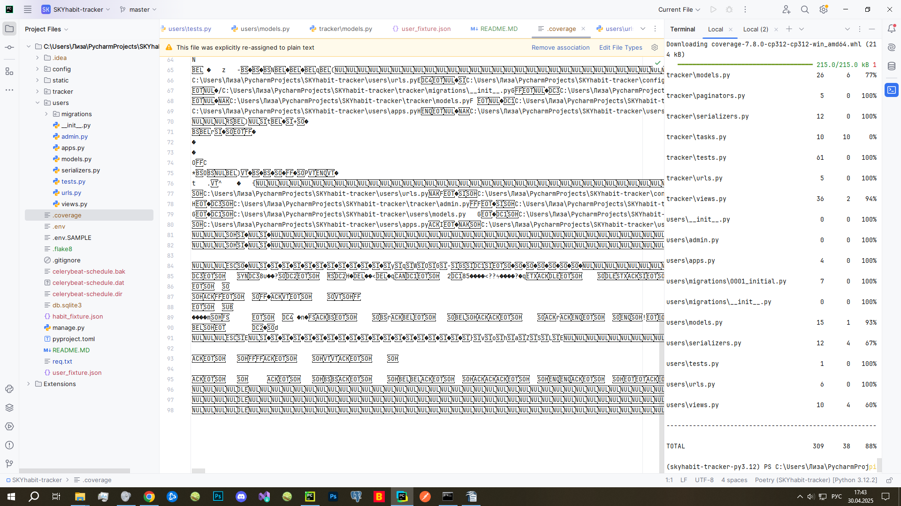

# Курсовой проект "HABIT TRACKER"

## Установка:

1. Клонируйте репозиторий:
git clone https://github.com/ElizaSwanson/Skyhabit-tracker

2. Установите зависимости:

```
pip install -r req.txt
```
3. Создайте и заполните данными файл .env по шаблону .env.sample
4. Пропишите команды:
```
python manage.py makemigrations
python manage.py migrate
```
5. Можете добавить заранее созданные фикстуры:

```
   python manage.py loaddata user_fixture.json --format json
   python manage.py loaddata habit_fixture.json --format json
```
## Тесты:
скриншот о покрытии тестами прилагается:
